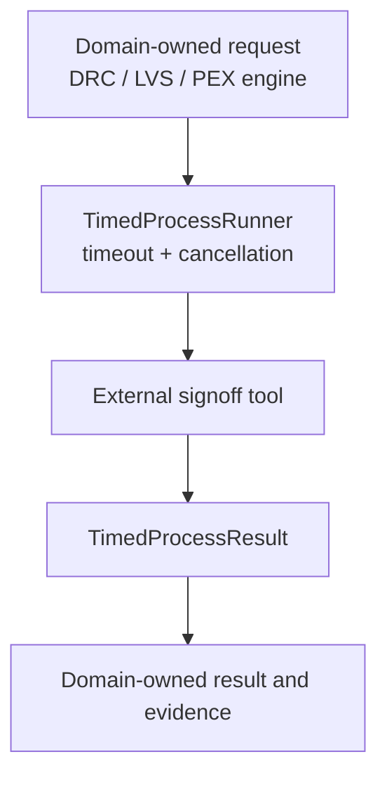

# SignoffToolSupport Design Contract

## Responsibility

`SignoffToolSupport` is shared infrastructure for external signoff tool
invocation. It owns process timeout validation, cooperative cancellation,
process-group cleanup, profile-driven PDK discovery, and lightweight signoff
deck readiness inventories.

It does not own DRC, LVS, PEX, STA, EM/IR, ERC/ESD, latch-up, DFM, or foundry
rule semantics. Those remain in the domain engines and their qualification
evidence.

## Domain integration

`TimedProcessRunner` owns process safety and is injected or composed by a
concrete domain engine. The domain package defines its own Foundation-backed
request, result, artifacts, diagnostics, and evidence. A process exit code is
never interpreted here as a signoff verdict or tool qualification decision.

## Ownership boundary

| Concern | Owner |
|---|---|
| Engine request/result and artifact provenance | Domain signoff engines using CircuiteFoundation |
| Timeout, cancellation, and descendant process cleanup | SignoffToolSupport |
| PDK root/profile discovery and deck readiness inventory | SignoffToolSupport |
| DRC/LVS/PEX/STA/EM-IR rule semantics | Domain signoff engines |
| Tool capability and trust qualification | ToolQualification |
| Flow ordering, approval, retry, and resume | DesignFlowKernel |
| Project/run artifact persistence | Xcircuite / DesignFlowKernel |

## Deliberate non-goals

- No signoff verdict is inferred from process completion.
- No native or external tool is treated as foundry-qualified by this package.
- PDK profiles describe required assets and semantic coverage; they are not a
  replacement for the domain rule database.
- The package does not own project state, human approvals, or flow scheduling.

## Handoff for implementation agents

An implementation agent implements the domain package's own execution protocol
directly. Every external launch passes through `TimedProcessRunner`; the domain
implementation converts captured output and process failures into its typed
diagnostics and materializes its own verified artifacts.
