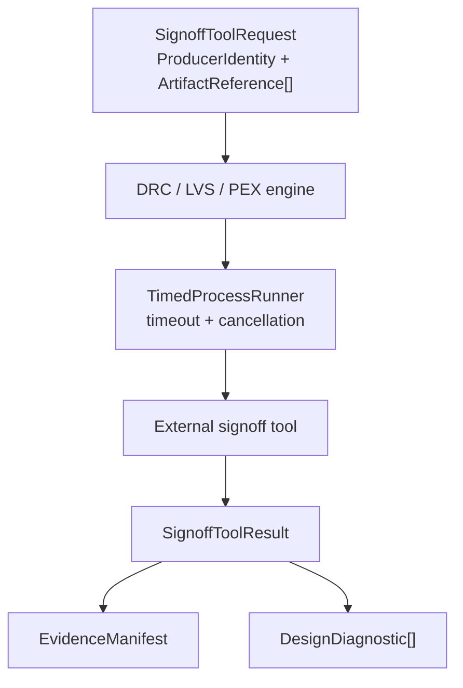

# SignoffToolSupport Design Contract

## Responsibility

`SignoffToolSupport` is shared infrastructure for external signoff tool
invocation. It owns process timeout validation, cooperative cancellation,
process-group cleanup, profile-driven PDK discovery, and lightweight signoff
deck readiness inventories.

It does not own DRC, LVS, PEX, STA, EM/IR, ERC/ESD, latch-up, DFM, or foundry
rule semantics. Those remain in the domain engines and their qualification
evidence.

## CircuiteFoundation integration

The package depends on and re-exports `CircuiteFoundation` for its shared
execution boundary:

- `SignoffToolRequest` identifies the producer and immutable input artifacts,
  with optional configuration and design-revision digests.
- `SignoffToolResult` carries output `ArtifactReference` values, structured
  diagnostics, and an `EvidenceManifest` from caller-supplied provenance.
- `SignoffToolEngine` refines `CircuiteFoundation.Engine` for domain adapters.

`TimedProcessRunner` remains the owner of process safety. It must be injected
or composed by a concrete engine; the Foundation protocol does not launch a
process and does not infer tool qualification from an exit code.

## Ownership boundary

| Concern | Owner |
|---|---|
| Engine, artifact, provenance, and diagnostic vocabulary | CircuiteFoundation |
| Timeout, cancellation, and descendant process cleanup | SignoffToolSupport |
| PDK root/profile discovery and deck readiness inventory | SignoffToolSupport |
| DRC/LVS/PEX/STA/EM-IR rule semantics | Domain signoff engines |
| Tool capability and trust qualification | ToolQualification |
| Flow ordering, approval, retry, and resume | DesignFlowKernel |
| Project/run artifact persistence | Xcircuite / DesignFlowKernel |

## Deliberate non-goals

- No signoff verdict is inferred from process completion.
- No native or external tool is treated as foundry-qualified by this package.
- PDK profiles describe required assets and semantic coverage; they are not a
  replacement for the domain rule database.
- The package does not own project state, human approvals, or flow scheduling.

## Handoff for implementation agents

An implementation agent may implement a concrete `SignoffToolEngine` for a
domain package. It must pass every external launch through `TimedProcessRunner`,
capture stdout/stderr and cancellation outcomes as typed diagnostics, and
materialize verified artifacts before constructing `SignoffToolResult`.
