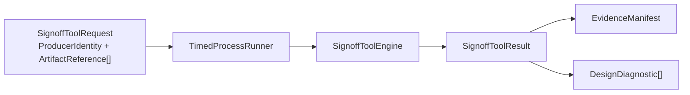

# SignoffToolSupport

Shared support for signoff tools used by the engine packages. This package owns
process execution safety, profile-driven PDK discovery, and lightweight readiness
inventories for external signoff decks. Domain engines still own DRC, LVS, and
PEX rule semantics.

## Xcircuite integration

[`Xcircuite`](https://github.com/1amageek/Xcircuite) is the umbrella runtime
that composes this package with the DRC, LVS, and PEX stage executors. The
support package remains responsible for safe process execution, PDK discovery,
and readiness inventories; it does not own flow lifecycle or project storage.

## CircuiteFoundation boundary

`SignoffToolSupport` now uses `CircuiteFoundation` for the cross-package
execution contract. `TimedProcessRunner` remains responsible for process
timeout, cancellation, and process-tree cleanup; the Foundation seam carries
artifact references, provenance, and structured diagnostics.



Concrete DRC/LVS/PEX packages should implement `SignoffToolEngine` and use
`SignoffToolResult` as their artifact hand-off. PDK profile models and the
deck-readiness reports remain local to this support package; they do not
become part of the shared Foundation vocabulary.

## Types

| Type | Responsibility |
|---|---|
| `TimedProcessRunner` | Process execution with mandatory timeout, task cancellation, optional external cancellation checks, and descendant process-tree cleanup on cancel/timeout — a hung child never outlives the run |
| `SignoffPDKProfile` | Codable profile artifact schema for PDK root naming, local discovery candidates, required deck files, standard-cell library deck templates, semantic source roles, and semantic coverage checks |
| `SignoffPDKProfileCatalog` | Codable catalog artifact schema for selecting bundled or external signoff PDK profiles by profile ID without hard-coding a process-specific default in Swift callers |
| `SignoffPDKLocator` | Resolves a PDK root and required files from `SignoffPDKProfile` data instead of process-specific Swift constants |
| `SignoffDeckInventory` | Emits the `signoff-foundry-deck-readiness` API report from profile-declared deck requirements, including `blocked` diagnostics when required PDK assets are missing |
| `SignoffDeckSemanticInventory` | Emits the `signoff-foundry-deck-semantics` API report from profile-declared semantic sources and coverage checks while keeping Magic / Netgen dialect summary parsing in Swift; Magic DRC summaries include cut classes, contact-stack connectivity, wiring contact geometry, exact overlap, enclosed-hole patterns, and unit scaling |
| `Resources/signoff-pdk-profile-catalog.json` | Default selectable signoff PDK profile inventory; it points at profile resources as data |
| `Resources/sky130-signoff-pdk-profile.json` | Sky130 Open PDK profile data for required files, standard-cell SPICE deck templates, and semantic checks; this is data, not a process-specific implementation owner |

## Rules

- Every external tool launch goes through `TimedProcessRunner`; invalid timeouts are
  rejected before launch, and cancellation kills the whole process tree, not just
  the parent.
- Long-running adapters can pass a cancellation check that polls their owning run
  artifact, so Human / Agent cancellation records can terminate external tools
  without relying on UI state.

## Build & test

```bash
swift build
swift test
```
